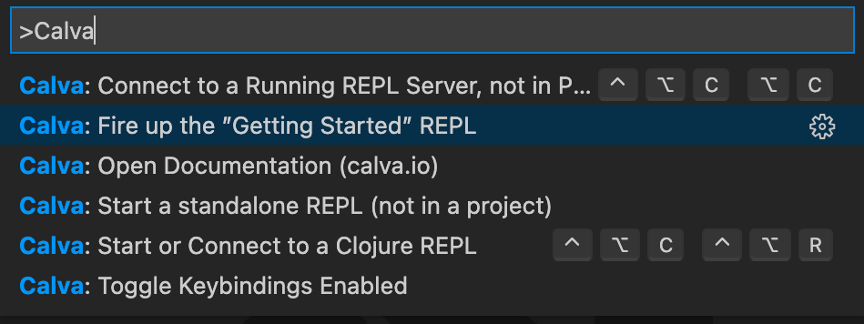
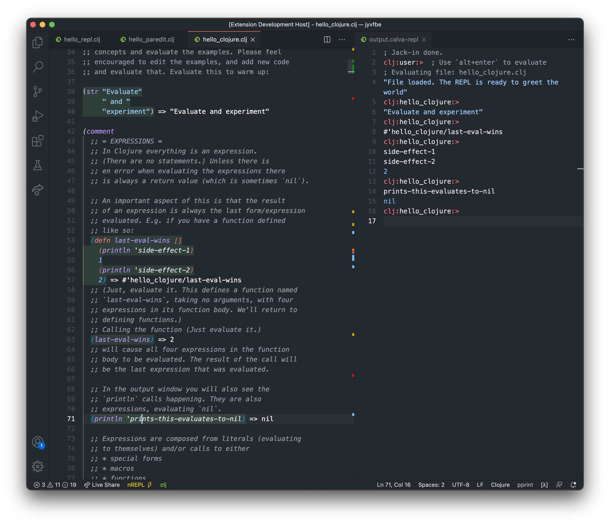

# dram - An Interactive Clojure Beginner's Guide

The first sips of [Calva](https://calva.io), [Clojure](https://clojure.org), [Paredit](https://calva.io/paredit), or anything Clojure-ish, really.

## Made for Calva's Getting Started REPL

This is a repository for **Getting Started** files for Calva. 

See: https://calva.io/getting-started/

## How to Contribute

Fork the repo, jack-in, fix stuff while you test it interactively. Send PRs.

See the *drams* directory for the files. Make sure to edit the files inside the appropriate subdirectories of `drams` and not the files at the top level of `drams`.

## Definitions
<dl>
  <dt><strong>dram</strong></dt>
  <dd>noun • <em>mainly Scottish</em> a small drink of whisky or other spirits: a wee dram to ward off the winter chill.</dd>
</dl>

## License

The original author [Peter Strömberg aka PEZ](https://github.com/PEZ) claims No Copyright: 
* https://creativecommons.org/publicdomain/zero/1.0/

(Don't hesitate to credit me if you use the material, I do enjoy that.)